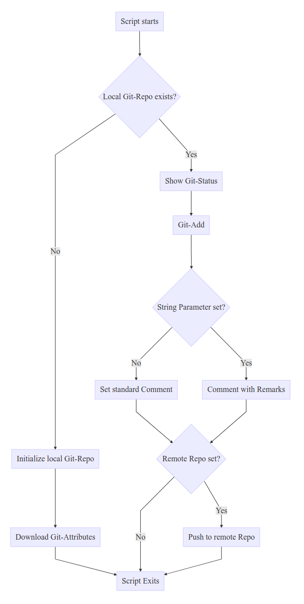

# bash-scripts

A tiny collection of **Shell-Scripts** I use on a regular basis.

  

## Table of Contents

<!-- toc -->

* [git_it.sh](#git-script) - Git automation
* [make_workdir.sh](#workbench-script) - For my daily Workbench
* [update.sh](#debian-update-script) - Automaticly update Debian-based systems
* [extern_ip.sh](#public-ip) - Show public IP
  * *Installers*:
  * [install_composer.sh](#install-composer) - Automaticly install **Composer** on Debian-based systems (with **Laravel** `a PHP-Framework`)

<!-- toc stop -->

## Git-Script

The innitial run of this script checks if a Git-Repo already exists.

If not, it runs

    git init

The Repo will be created and it'll **remind** you to set the remote Repo.

    echo "!---!";
    echo "Set remote repository";
    echo "e.g.:";
    echo "git remote add origin git@github.com:mmuyakwa/bash-scripts.git";
    echo "!---!";

At this stage the scripts **exits** the `initial run`.

If you run the script another time it will check for changes and stages these and commits them.

    git status -s
    git add -A
    git commit -m "Committed at: $now (automatic via script)"

If you run this script with an string, that string ("`Your Message`") will be used for the commit-message.

    git_it.sh "Your Message"

which will then

    git commit -m "Your Message - Committed at: $now"

The last step is to check if a remote Repo ist set and push the repo to remote.

    git push -u origin master

### Flowchart

### Usage

    sh git_it.sh # Initializes the Git-Repository on first run.
                 # Stages, Committs and Pushes if remote Repo is set.
    sh git_it.sh "Your Message" # Adds "Your Message" to the Commit-Message.

## Workbench-Script

Before starting a new project, I usually generate a Folder with the current date, where I put my project folders into.

    e.g.: ~/Dokumente/Workbench/2018/01/2018-01-04/

There I generate my project folders for the day.

Only if a project pens our, will I move it to my **main** `projects folder`.

I generate the foldername with the current date via:

    WorkDirPath=~/Dokumente/Workbench/$(date +"%Y")/$(date +"%m")/$(date +"%Y-%m-%d")

And create the folder via **mkdir** with the parameter `-p` which will show no errors if a folder already exists, while creating that path.

### Usage

    sh make_workdir.sh # Simply creates the folder with the path of the current date.

## Debian Update-Script

This script is intended for developer-machines.
**I would not recommend using this on a productive system.**
This script first checks if you are **root**.
If you are `not` **root**, all `apt-get`-commands will run with `sudo`, assuming you are in the **sudo-group**.

    SUDO=''
    if [ $(id -u) -ne 0 ]; then
        SUDO='sudo'
        echo "Your not root."
    fi

The following `apt-get`-commands will be issued:

    $SUDO apt-get update -y
    $SUDO apt-get upgrade -y
    $SUDO apt-get dist-upgrade -y
    $SUDO apt-get autoremove -y
    $SUDO apt-get autoclean -y

The script will not ask for further permission, because everything is automaticly approved.

### Usage

    sh update.sh # Updates the system and approves every change (Must be root or a SUDO-User).

## Public-IP

`extern_ip.sh` is a simple small script which shows the current public IP of your host. (IP will be fetched from [http://checkip.dyndns.org/](http://checkip.dyndns.org/) )

    user@client:~/scripts/bash$ sh extern_ip.sh
    73.217.243.152

### Usage

    sh extern_ip.sh # Simply prints your public IP on the console.

## Install Composer

`install_composer.sh` is a script I wipped up to quickly install **Composer** on development machines (mostly on VM's).

MIT License
